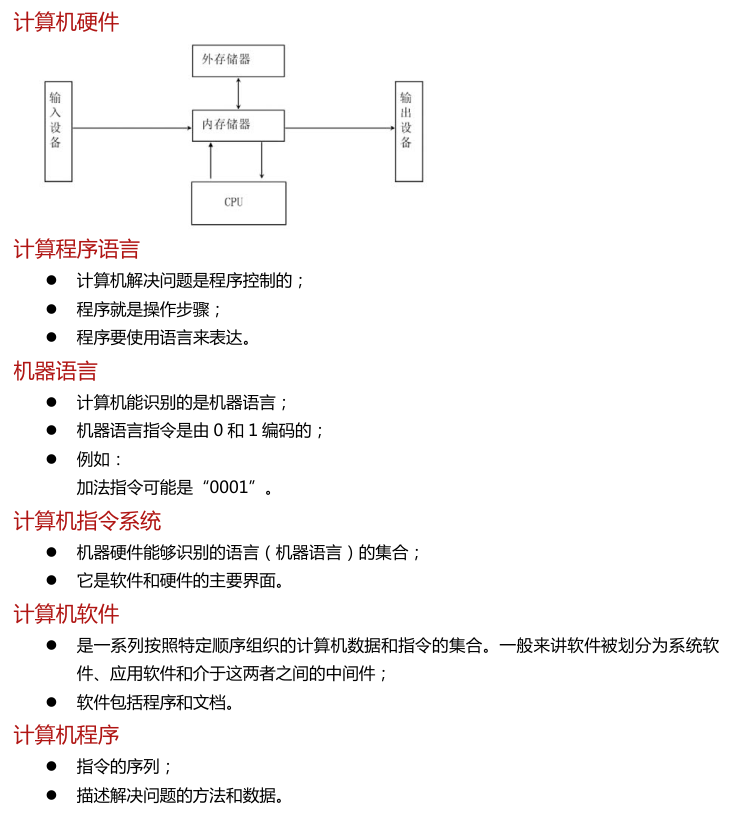
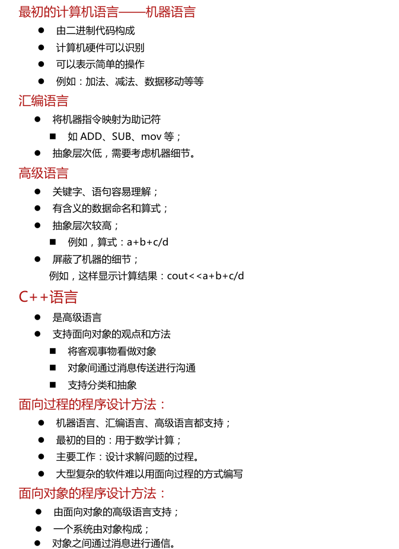
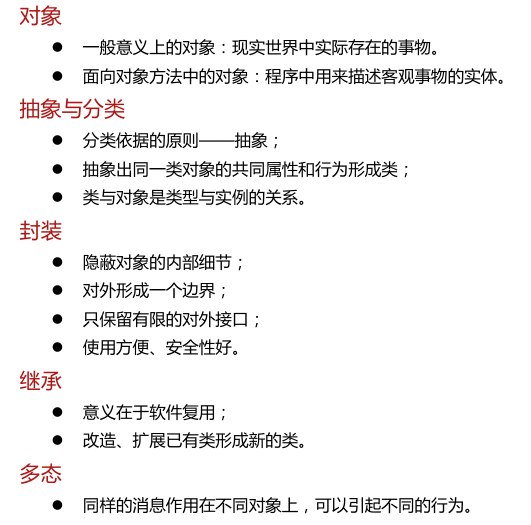
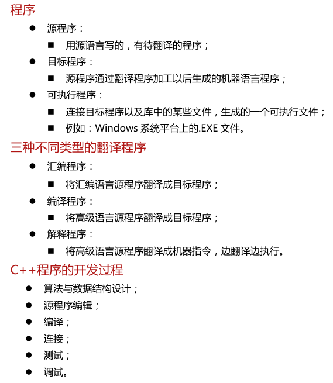
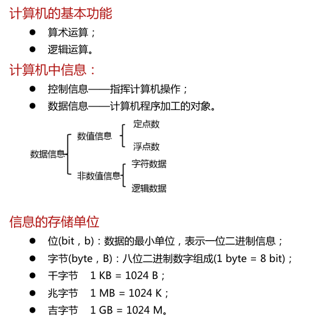
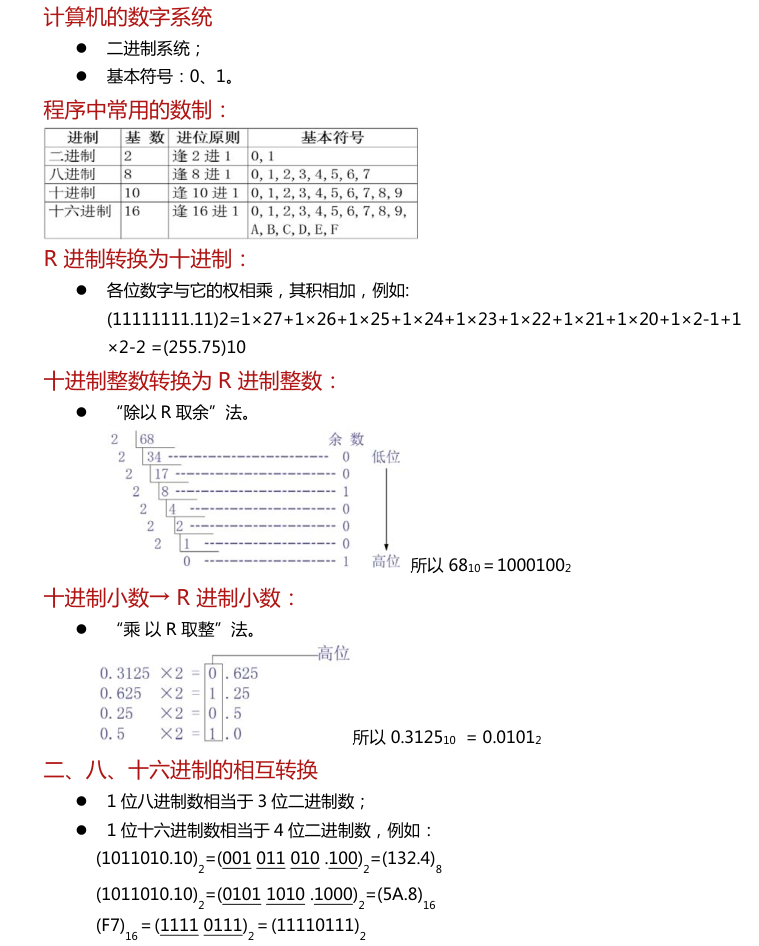
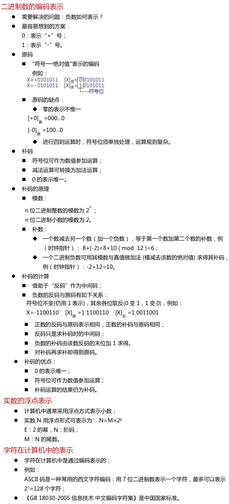

# CPP基础笔记

## 参考资源

*   郑莉课为主，南科大为辅助
*   C++南科大
    *   https://www.bilibili.com/video/BV1Vf4y1P7pq
    *   https://github.com/ShiqiYu/CPP
*   算法笔记
    *   https://sunnywhy.com/course/2178/model/2185?itemId=1777

# 第一章绪论

## 整体认识

*   一、计算机系统
    *   计算机系统由硬件、软件组成；
    *   指令系统是硬件和软件的界面。
*   二、计算机语言和程序设计方法
    *   计算机语言
        *   程序员与计算机沟通的语言；
        *   描述解决问题的方法和相关数据。
    *   计算机语言的级别
        *   二进制代码构成的机器语言；
        *   使用助记符的汇编语言；
        *   使用类似英语单词和语句的高级语言；
        *   C++是面向对象的高级语言
    *   C++支持的程序设计方法
        *   面向过程的程序设计方法；
        *   面向对象的程序设计方法；
        *   泛型程序设计方法。
*   三、C++程序的开发过程
    *   算法设计
    *   源程序编辑
    *   编译
    *   连接
    *   运行调试
*   四、信息在计算机中的表示与存储
    *   计算机中的数据用二进制表示；
    *   逻辑数据、字符数据用二进制编码表示。
*   实践：练习题+实验一：环境配置

## 计算机系统基本概念

*   

## 计算机语言和程序设计方法

## 面向对象的基本概念

## 程序的开发过程

## 计算机中的信息与存储单位

## 计算机的数字系统

## 数据在计算机中的编码表示

# 第二章数据的控制

## 整体认识

*   计算机的最基本功能是数据处理
    *   C++支持的基本数据类型：
        *   整数、实数、字符、布尔数据
    *   C++支持的基本运算
        *   算术运算、关系运算、逻辑运算、位运算、逗号运算、条件运算
*   程序要能够输入数据、输出数据
    *   C++中的数据输入/输出可以调用预定义的功能模块实现
*   程序的执行流程
    *   顺序的，因此程序要能够
    *   对执行流程进行选择（选择、开关语句）；
    *   反复用同一算法依次处理大批量数据（循环语句）。
*   枚举类型
    *   通过列出所有可取值来定义一种新类型。

## C++语言概述

特点和程序实例

C++字符集和词法记号

C++ keywords：http://en.cppreference.com/w/cpp/keyword

## 基本数据类型和表达式

程序举例

算术运算与赋值运算

逗号运算、关系运算、逻辑运算和条件运算

Sizeof 运算、位运算

运算优先级、类型转换

## 数据的输入和输出

## 算法的基本控制结构

if 语句

## 类型别名和类型推断

## 数据控制背后的原理

*   变量的实现机制
*   C++表达式的执行原理

# 第三章函数

## 整体认识

## 函数的定义与调用

函数的嵌套调用

函数的递归调用

函数的参数传递

含有可变参数的函数

## 内联函数、`constexpr` 函数

## 带默认参数值的函数

## 函数重载

## C++系统函数

# 第四章 类与对象

## 整体认识

## 面向对象程序设计的基本特点

## 类和对象

## 构造函数和析构函数

## 类的组合

前向引用声明

## 结构体和联合体

# 第五章 数据的共享与保护

## 整体认识

## 标识符的作用域与可见性

## 对象的生存期

## 类的静态数据成员

## 类的友元

## 共享数据的保护

## 多文件结构和编译预处理命令

# 第六章 数组、指针与字符串

## 整体认识

## 数组

## 指针

## 动态内存分配

## vector 对象

## 对象复制与移动

## 字符串

# 第七章继承与派生

## 整体认识

## 继承的基本概念

>   基类和派生类

## 继承方式

>   访问控制

## 类型兼容规则

## 派生类的构造函数和析构函数

## 派生类成员的标识与访问

# 第八章多态性

## 整体认识

## 多态性概述

## 运算符重载

## 虚函数

## 纯虚函数与抽象类

# 第九章模板与群体数据

## 整体认识

## 函数模板与类模板

## 线性群体

## 群体数据的组织

# 第十章泛型程序设计与C++标准模板库

## 整体认识

## 泛型程序设计及STL的结构

## 迭代器

## 容器的基本功能与分类

## 顺序容器

## 关联容器

## 函数对象

## STL 算法

# 第十一章流类库与输入、输出

## 整体认识

http://www.cplusplus.com/reference/

## I/O流的概念及流类库结构

## 输出流

## 输入流

## 输入/输出流

# 第十二章异常处理

## 整体认识

## 异常处理的思想与程序实现

## 异常处理中的构造与析构

## 标准程序库异常处理
