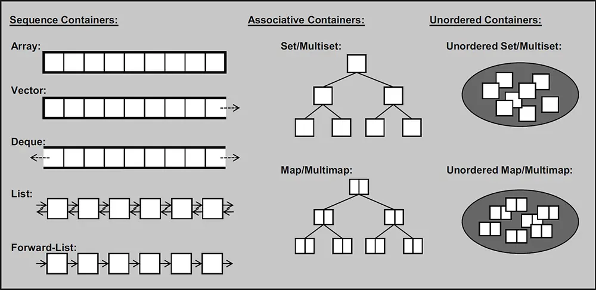

# C和Cpp基础入门笔记

编译器选择与环境配置


# 上篇：C language

# 一、变量与运算 C

## （一）数据类型

### 1、第一个C程序

*   C程序的结构
*   运行Ｃ程序的步骤
*   [输入输出](https://www.runoob.com/cprogramming/c-input-output.html)
    *   getchar() & putchar() 函数
    *   gets() & puts() 函数
    *   `printf`输出和`scanf`输入

*   单行和多行注释

### 2、数据类型

有基本数据类型和派生类型（数组、指针、结构体），先学基本数据类型

*   基本数据类型
    *   整型
        *   char、unsigned char、signed char
        *   int、unsigned int
        *   short、unsigned short
        *   long、unsigned long
        *   sizeof 运算符

    *   [字符型与字符串](https://www.runoob.com/cprogramming/c-strings.html)
    *   浮点型
        *   float、double、long double

    *   双精度浮点型
    *   数据类型转换
    *   枚举类型

*   void 类型
    *   函数返回为空
    *   函数参数为空
    *   指针指向void

*   数据类型转换
    *   隐式类型转换
    *   显式类型转换

*   算数运算符
    *   `+ - * / % ++ --`
    *   变量 A 的值为 10，A++ 将得到 11

*   位运算符
    *   `&` 按位与
    *    `|` 按位或
    *   ` ^`异或
    *   `~` 取反
    *   `<<` 二进制左移
    *   `>>` 二进制右移


### 3、[变量](https://www.runoob.com/cprogramming/c-variables.html)

*   定义、声明、使用
*   左值和右值
*   常量（字面量）
    *   使用 **#define** 预处理器
    *   使用 **const** 关键字
*   赋值运算符
    *   = 、+=、-=、*=、/=、%=、<<=、>>=、&=、^=、|=
    *   C += A 相当于 C = C + A
*   运算符优先级

## （二）流程控制

### 1、分支测试

*   关系运算符：`== != > < >= <=`

*   逻辑运算：`&& || !`

*   三元运算符

    *   `? :` 如果条件为真 ? 则值为 X : 否则值为 Y
    *   b = (a == 1) ? 20: 30

*   if

    *   if语句

    *   if-else语句（else if）

    *   ```c
        if(boolean_expression 1)
        {
           /* 当布尔表达式 1 为真时执行 */
        }
        else if( boolean_expression 2)
        {
           /* 当布尔表达式 2 为真时执行 */
        }
        else if( boolean_expression 3)
        {
           /* 当布尔表达式 3 为真时执行 */
        }
        else 
        {
           /* 当上面条件都不为真时执行 */
        }
        ```

    *   嵌套if语句

*   switch 语句

    *   ```c
        switch(expression){
            case constant-expression  :
               statement(s);
               break; /* 可选的 */
            case constant-expression  :
               statement(s);
               break; /* 可选的 */
          
            /* 您可以有任意数量的 case 语句 */
            default : /* 可选的 */
               statement(s);
        }
        ```

    *   嵌套 switch 语句

### 2、循环

*   循环类型

    *   while循环

    *   ```c
        while(condition)
        {
           statement(s);
        }
        ```

    *   for循环

        *   ```c
            for ( init; condition; increment )
            {
               statement(s);
            }
            ```

        *   for循环在传统意义上可用于实现无限循环`for( ; ; )`

    *   do...while循环

        ```c
        do
        {
           statement(s);
        
        }while( condition );
        ```

*   嵌套循环

*   循环控制语句：break、continue、goto

## [（三）枚举](https://www.runoob.com/cprogramming/c-enum.html)

*   定义一组具有离散值的常量，如果没有指定，那么默认从 **0** 开始递增
*   可以在定义枚举类型时改变枚举元素的值，没有指定值的枚举元素，其值为前一元素加 1
*   三种定义枚举变量的方式（`enum　枚举名　{枚举元素1,枚举元素2,……};`）
    *   先定义枚举类型，再定义枚举变量
    *   定义枚举类型的同时定义枚举变量
    *   省略枚举名称，直接定义枚举变量

# 二、函数、指针与结构类型 C

## （一）函数

### 1、函数的定义与调用

-   每个 C 程序都至少有一个函数，即主函数 **main()** 

-   函数**声明**告诉编译器函数的名称、返回类型和参数

    -   当在一个源文件中定义函数且在另一个文件中调用函数时，函数声明是必需的
    -   一般情况在调用函数的文件顶部声明函数

    ```c
    return_type function_name( parameter list );
    ```

-   函数**定义**提供了函数的实际主体

    ```c
    return_type function_name( parameter list )
    {
       body of the function
    }
    ```

-   C 标准库提供了大量的程序可以调用的内置函数

-   函数还有很多叫法，比如方法、子例程或程序，等等

-   函数的调用：调用函数时，传递所需参数，如果函数返回一个值，则可以存储返回值

### 2、函数参数

-   函数定义时声明的参数值变量称为函数的形式参数
-   有两种向函数传递参数的方式
    -   [传值调用](https://www.runoob.com/cprogramming/c-function-call-by-value.html)：把参数的实际值复制给函数的形式参数。在这种情况下，修改函数内的形式参数不会影响实际参数
    -   [引用调用](https://www.runoob.com/cprogramming/c-function-call-by-pointer.html)：通过引用传递方式，形参为指向实参地址的指针，当对形参的指向操作时，就相当于对实参本身进行的操作
-   默认情况下，C 使用**传值调用**来传递参数
-   [作用域](https://www.runoob.com/cprogramming/c-scope-rules.html)
    -   程序中定义的变量所存在的区域，超过该区域变量就不能被访问
    -   在函数或块内部的**局部**变量、在所有函数外部的**全局**变量、在**形式**参数的函数参数定义中
    -   当局部变量被定义时，系统不会对其初始化，需要自行对其初始化。定义全局变量时，系统会自动对其初始化
-   [可变参数](https://www.runoob.com/cprogramming/c-variable-arguments.html)

### 3、[递归](https://www.runoob.com/cprogramming/c-recursion.html)

## （二）数组

### 1、一维数组的定义和引用

*   数组的概念

    *   数组的声明是先声明一个数组变量，然后使用变量索引来代表一个个单独的变量
    *   于是，数组中的特定元素可以通过索引访问，第一个索引值为 0
    *   所有的数组都是由连续的内存位置组成：最低的地址对应第一个元素，最高的地址对应最后一个元素

*   一维数组的定义和引用

    *   声明数组：

    *   ```c
        type arrayName [ arraySize ];
        ```

    *   初始化数组：可以逐个初始化数组，也可以使用一个初始化语句

    *   如果省略掉了数组的大小，数组的大小则为初始化时元素的个数

    *   访问数组元素：数组元素可以通过数组名称加索引进行访问，元素的索引是放在方括号内，跟在数组名称的后边

### 2、多维数组的定义和引用

*   ```c
    type name[size1][size2]...[sizeN];
    ```

*   二维数组：`type arrayName [ x ][ y ];`

*   初始化二维数组：多维数组可以通过在括号内为每行指定值来进行初始化

*   访问二维数组元素：二维数组中的元素是通过使用下标（即数组的行索引和列索引）来访问的

### 3、函数与数组

*   传递数组给函数（在函数中传递一（多）维数组作为参数）

    *   ```c
        // 形式参数是一个指针
        void myFunction(int *param)
        {
        	...
        }
        ```
        
    *   ```c
        // 形式参数是一个已定义大小的数组
        void myFunction(int param[10])
        {
        	...
        }
        ```
        
    *   ```C
        // 形式参数是一个未定义大小的数组
        void myFunction(int param[])
        {
        	...
        }
        ```

*   [从函数返回数组](https://www.runoob.com/cprogramming/c-return-arrays-from-function.html)

    *   C 语言不允许返回一个完整的数组作为函数的参数，但可以通过指定不带索引的数组名来返回一个指向数组的指针
    *   如果想要从函数返回一个一维数组，必须声明一个返回指针的函数
    *   另外，C 不支持在函数外返回局部变量的地址，除非定义局部变量为 **static** 变量


## （三）[指针](https://www.runoob.com/cprogramming/c-pointers.html)

### 1、指针基础

-   指针是一个内存地址，指针变量是用来存放内存地址的变量
-   指针变量声明的一般形式为：`type *var_name;`
-   `*` 指向一个变量、`&` 返回变量的地址
-   C 中的 NULL 指针（空指针）：在变量声明的时候，如果没有确切的地址可以赋值，为指针变量赋一个 NULL 值是一个良好的编程习惯
-   使用指针：定义一个指针变量、把变量地址赋值给指针、访问指针变量中可用地址的值
-   [指针的算术运算](https://www.runoob.com/cprogramming/c-pointer-arithmetic.html)
    -   指针的递增与递减
        -   指针的每一次递增，它其实会指向下一个元素的存储单元。
        -   指针的每一次递减，它都会指向前一个元素的存储单元。
        -   指针在递增和递减时跳跃的字节数取决于指针所指向变量数据类型长度，比如 int 就是 4 个字节
    -   指针的比较：用关系运算符进行比较，如 ==、< 和 >

### 2、指针与派生类型

*   [指向指针的指针](https://www.runoob.com/cprogramming/c-pointer-to-pointer.html)

*   [指针变量与数组](https://www.runoob.com/cprogramming/c-pointer-to-an-array.html)

    -   数组名是一个指向数组中第一个元素的常量指针

    -   使用数组名作为常量指针是合法的，反之亦然

    -   [C 指针数组](https://www.runoob.com/cprogramming/c-array-of-pointers.html)

*   指针与函数

    *   [传递指针给函数](https://www.runoob.com/cprogramming/c-passing-pointers-to-functions.html)
    *   [从函数返回指针](https://www.runoob.com/cprogramming/c-return-pointer-from-functions.html)
    *   [函数指针与回调函数](https://www.runoob.com/cprogramming/c-fun-pointer-callback.html)

## （四）结构类型

### 1、[结构类型的定义](https://www.runoob.com/cprogramming/c-structures.html)

-   自定义的可用的数据类型
-   定义结构：结构体定义由关键字 **struct** 和结构体名组成，结构体名可以根据需要自行定义
-   结构变量的初始化：对结构体变量可以在定义时指定初始值
-   访问结构成员：使用成员访问运算符`.`

-   结构作为函数参数
    -   结构变量作为函数参数
    -   结构指针变量作为函数参数
    -   结构数组作为函数参数
-   结构数组
-   指向结构的指针

### 2、[共用体](https://www.runoob.com/cprogramming/c-unions.html)

-   提供了一种使用相同的内存位置的有效方式
-   定义共用体
-   访问共用体成员

### 3、[位域](https://www.runoob.com/cprogramming/c-bit-fields.html)、[typedef](https://www.runoob.com/cprogramming/c-typedef.html)

# 三、文件与Advanced C

## （一）文件读写

-   文件指针
-   文件的打开
-   文件的关闭

## （二）Advanced C

### 1、预处理器、头文件

### 2、错误处理

### 3、内存管理

*   动态分配内存
*   重新调整内存的大小和释放内存
*   命令行参数进行解析

### 4、C with STL

# 下篇：Cpp language

# 一、从C到Cpp+


# 二、类与对象Cpp


# 三、C++标准库STL

## （一）STL容器




## （二）STL算法

## （三）More

# 四、Advenced Cpp

## （一）C++ 11新特性

## （二）C++高级主题

# 五、设计模式


# 资源链接与参考

## for C

教程：

* C primer plus
* Linux C编程一站式学习
* [菜鸟教程-C语言](https://www.runoob.com/cprogramming/c-intro.html)

课程：

*   [C语言程序设计_大连理工大学](https://www.icourse163.org/course/DUT-1001948002)
*   [程序设计与算法（一）C语言程序设计_pku](https://www.icourse163.org/course/PKU-1001553023)
*   [程序设计与算法(二)算法基础(国家精品)](https://www.icourse163.org/course/PKU-1001894005)

内容：

[C程序编译流程]( https://bbs.huaweicloud.com/blogs/291863)

[使用Dev-C++调试程序](https://www.jianshu.com/p/1602264dadf2)

[刷题：浙江大学 PAT](https://www.patest.cn/practice)

## for Cpp

教程：

*   [SAST skill docs:C++ 语言面向对象](https://docs.net9.org/languages/c-oop/)
*   [oi.wiki:Cpp入门](https://oi.wiki/lang/helloworld/)

课程：

*   [程序设计与算法（三）C++面向对象程序设计](https://www.icourse163.org/course/PKU-1002029030)


