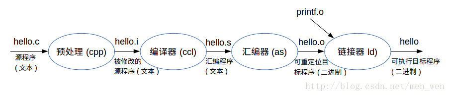
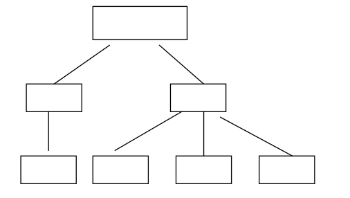

# 摘要

>   概念的接触应当先于知识应用的训练，比如指针，初步在函数之前了解，在函数中应用，在函数与数组之后深化所以指针方面的习题在函数与数组的分支下

首先，了解计算机硬件结构，进一步以让屏幕输出Hello, World!切入开始编程之旅。

然后开始学习变量与运算部分，在此基础上学习计算机的流程控制，主要有

选择语句之

-   if 语句
-   if-else 语句
-   switch 语句

循环语句之

-   for 语句
-   while 语句

同时铺垫指针的概念，在后续的学习中不断深化对其理解。

进一步开始学习函数与数组，使用函数来让程序变得模块化，降低实现成本。数组是一组相同类型的值，按照顺序储存在一起。用于存储大量相同类型的数据。

最后学习结构体和文件。

同时，值得一提的是，编程能力的提升是通过多做编程题提高的，尤其是多做难题，对掌握并熟练C语言的基本方法和技巧有着不可替代的重要性。如果通过一门基础课的学习，只是记住了若干概念，背了几个结论，而未能在这方面有所长进，那就真是“入宝山而空返”了。技巧的熟练固非一日之功，但取法乎上，仅得乎中，必须在开始学编程时就设定一个高目标。而经验表明，在打基础的阶段，重视习题十分重要，前人的各种经验固然重要，而要达到“熟”，舍大量做题，无他捷径可循。

# C 语言基础

## 编译器的选择

`Dev-C++`

## 编译原理

C 语言是一种编译型语言，源码都是文本文件，本身无法执行。

我们书写的代码通过编译器，生成二进制的可执行文件，才能执行。编译器将代码从文本翻译成二进制指令的过程，就称为编译阶段，又称为“编译时”（compile time），跟运行阶段（又称为“运行时”）相区分。

整个原理过程可以参考—— [C 程序的编译流程](https://bbs.huaweicloud.com/blogs/291863)



## 例程：Hello World !

```c
#include <stdio.h>

int main(void) {
  printf("Hello World\n");
  return 0;
}
```

## C程序的组成

C语言由主函数和子函数组成。每次运行程序手动执行的叫做主函数，子函数是由主函数调用执行的。



## 程序设计与[流程控制](https://blog.csdn.net/weixin_40763897/article/details/103643158?utm_medium=distribute.pc_relevant.none-task-blog-2~default~baidujs_baidulandingword~default-0-103643158-blog-117022216.pc_relevant_recovery_v2&spm=1001.2101.3001.4242.1&utm_relevant_index=3)

结构化程序设计方法：解决复杂问题的方法之一，即分而治之，合而用之。

>   **归约论**是一种哲学方法，它认为只有理解一个事物的每个组成部分后才能很好地理解该事物。
>
>   **整体论**正好与之相反，它认为整体并非每一部分的简单叠加。在学习编写程序时，必须学会从这两种角度分析程序。若只注意大的方面，则不能理解解决问题需要的工具。若过分关注细节，则会只见树木不见森林。
>
>   在学习程序设计时，最好的方法是交替使用这两种视角。整体论有助于从整体上把握程序的作用，使程序员对程序设计过程的直觉更加敏锐，并能够从较高的层面研究程序，理解这个程序是干什么的。另一方面，在实际写程序时，则需要适当采用归约法，以了解程序是怎样结合在一起的。

流程控制：描述数据处理的过程，即程序的控制过程。

单位级控制：程序模块之间的控制（调用、返回），不需展开。

### 变量

C语言处理的数据以变量或常量的形式存在

### 语句、表达式

C 语言的代码由一行行语句（statement）组成。语句就是程序执行的一个操作命令，必须使用分号结尾

表达式（expression）是一个计算式，用来获取值

### 语句块

C 语言允许多个语句使用一对大括号`{}`，组成一个块，也称为复合语句（compounded statement）。在语法上，语句块可以视为多个语句组成的一个复合语句。

### 空格

C 语言里面的空格，主要用来帮助编译器区分语法单位。如果语法单位不用空格就能区分，空格就不是必须的，只是为了增加代码的可读性。

### 注释

注释是对代码的说明，编译器会忽略注释，也就是说，注释对实际代码没有影响。

### printf()

`printf()`的作用是将参数文本输出到屏幕。它名字里面的`f`代表`format`（格式化），表示可以定制输出文本的格式。

```c
printf("Hello World");
```

上面命令会在屏幕上输出一行文字“Hello World”。

## [程序的调试 Debug](https://www.jianshu.com/p/1602264dadf2)

调试，就是跟踪程序的运行过程，从而发现程序的逻辑错误（思路错误），或者隐藏的缺陷（Bug）。

在调试的过程中，我们可以监控程序的每一个细节，包括变量的值、函数的调用过程、内存中数据、线程的调度等，从而发现隐藏的错误或者低效的代码。

# 变量与运算


## 求两个整数之和

```c
#include <stdio.h>
int main( )
{ 
  int a,b,sum; 
  a = 123;                    
  b = 456;                     
  sum =  a + b;                  
  printf(”sum is %d\n”,sum);              
  return 0;                          
} 
```

## 华氏-摄氏温度转化

有人用温度计测量出用华氏法表示的温度(如F)，今要求把它转换为以摄氏法表示的温度(如C)。

>   备注：$c=\cfrac{5}{9}(f-32)$

```c
#include <stdio.h>
int main ( )
{
   float f,c; 
   f=64.0; 
   c=(5.0/9)(f-32); 
   printf("f=%f\nc=%f\n",f,c);        
   return 0;
 }
```

## 三角形面积

已知三角形的三边长，求三角形面积。

>   $area=\sqrt{s(s-a)(s-b)(s-c)} 其中，s=\frac{a+b+c}{2}$

```c
#include <stdio.h>
#include <math.h>

int main ( ){
    double a,b,c,s,area; 
    a=3.67;                                
    b=5.43;                 
    c=6.21;                            
    s=(a+b+c)/2;	                      
    area=sqrt(s(s-a)(s-b)(s-c));
    printf("a=%f\tb=%f\t%f\n",a,b,c);     
    printf("area=%f\n",area);
    
    return 0;
 }
```


# 流程控制与指针

## 流程控制


## 指针


# 函数与数组

## 函数


## 数组


# 结构


# 文件


# 资源链接

[1] 刷题：浙江大学 PAT https://www.patest.cn/practice

[2] 菜鸟教程-C语言 https://www.runoob.com/cprogramming/c-intro.html

[3] C程序编译流程 https://bbs.huaweicloud.com/blogs/291863

[4] 教材：C primer plus

[5] 使用Dev-C++调试程序 https://www.jianshu.com/p/1602264dadf2
